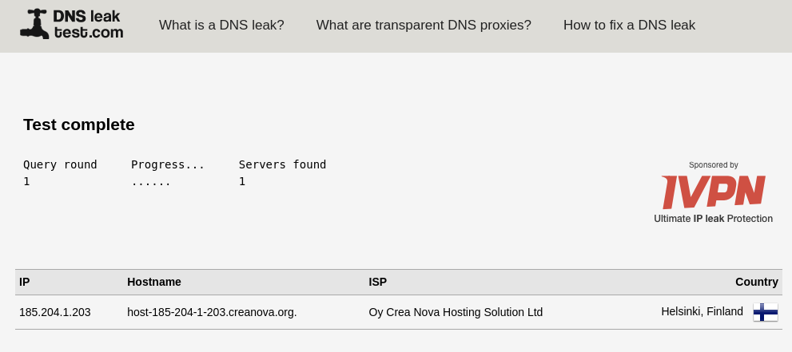
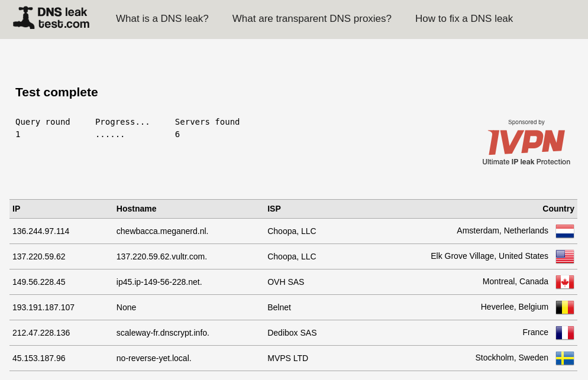
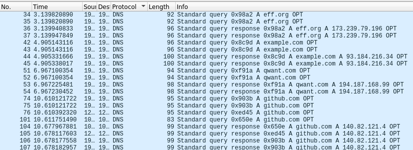
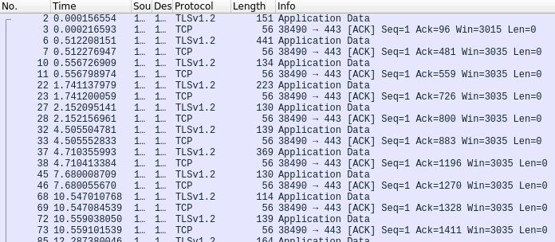

# Pi-Hole & DNSCrypt proxy dockerized

Nowadays, most people don't feel safe using HTTP when surfing on the web, they prefer using HTTPS instead that **encrypts* and **authenticates** their Internet communications, and they are right! But before using HTTPS when visiting a website by typing its **domain name** (e.g.: www.eff.org), your browser needs to know the **IP address** of the server it is trying to connect to.

And here the **DNS protocol** comes in, it will find the IP address linked to a particular domain name. **Problem**:  the DNS protocol is not secure by default and the domain you are looking for will be visible in plain text on the networks. But fortunately, there is a way to solve this problem:
- **DNSCrypt**: A dedicated protocol to encrypt, authenticate and anonymize DNS traffic.
- **DoH** (DNS over HTTPS): DNS packets encapsulated in HTTPS packets.
- **DNSSEC**: Authenticates DNS records and ensures data integrity.

Plus, the DNS protocol is used by companies to display **ads** and for **telemetry**. Some people would like to get rid of them, so using Pi Hole is the best choice.

This project allows anyone with basic IT knowledge to automatically setup two DNS proxies:
- **Pi-Hole**: this proxy will help **removing ads** and **telemetry** efficiency.
- **DNSCrypt**: this proxy will **encrypt** (DNSCrypt, DoH), **authenticate** (DNSSEC) and **anonymize** your DNS requests.

---

## Description

This goal of this project is to **setup and deploy** the two **proxies** embedded in **Docker containers**, and to provide a small Bash script to deploy and **update** them automatically.

#### Files description

- `run.sh`: updates and deploys automatically the two proxies.
- `docker-compose.yaml`: holds the containers configuration.
  - You may want to change the Pi-Hole exposed ports on your machine.
  - The admin web interface port is not exposed because the environment variables are not loaded for unknown reason, Thus anyone may access it.
  - You may want to edit the network configuration in case you already have one with the same subnet.
  - It is not a good security practice to setup the admin web interface password in plain text in this file. You should connect to the Pi-Hole container and change it manually by command line.
- `dnscrypt/dnscrypt-proxy.toml`: holds the DNSCrypt proxy configuration. You may want to edit it with you own configuration. Make sure to rebuild manually the Docker image once done.
- `etc-dnsmasq.d/01-pihole.conf`: holds the configuration of Pi-Hole.

#### How it works ?

Each proxy will be **embedded in a Docker container**. When deployed, only the DNS ports of the Pi-Hole containers will be exposed on the host machine.

When a DNS request comes into the host machine, actions will be the following:
1. The DNS request is **redirected to Pi-Hole** container.
2. The domain requested is **filtered** (ads, telemetry, other blacklists...).
3. Pi-Hole **redirects** the DNS request to the **DNSCrypt** container.
4. The DNS request is **encrypted** (DNSCrypt or DoH by default), **authenticated** (DNSSEC) and **anonymized** (around 70 DNS servers are used).
5. DNSCrypt container returns DNS response to Pi-Hole.
6. Pi-Hole container returns the DNS response.

#### How to ensure the proxies work correctly ?

###### Dnsleaktest Website
First, you should visit the website **https://www.dnsleaktest.com** and click on "*Standard test*". It will then display the DNS servers your machine is requesting to. Thus, it will allow you to ensure the servers are **not always the same** and that they support DNSCrypt, DoH and DNSSEC.

The following screenshot is a Standard test realized **without proxies**. You may note that a single DNS server is listed.

The following screenshot is a Standard test realized **with proxies**. This time, 6 servers are listed and they will change each time you'll do the test.

**Notes**: to perform this test, make sure to deploy the proxies **AND** to configure your machine to use `localhost` as DNS resolver (and make sure to specify the good port if it is not the default one 53).

###### Network traffic analysis
Second, you may ensure the DNS requests are **not sent in plain text**. I used **Wireshark** to capture the network traffic when requesting some domains with the `dig`. My test was:
1. **Deploy the proxies** on your machine with the `bash run.sh -f` command.
2. **Launch a network traffic recorder**, in this case Wireshark.
3. **Request some domains** ***without using the proxies*** with the dig command: `~$ dig eff.org`
4. **Request some domains** ***using the proxies*** with the dig command: `~$ dig @127.0.0.1 -p 53 eff.org`
5. **Stop the network traffic recorder**.

The following screenshot shows **network traffic filtered on DNS** protocol where we see all the domains in **plain text** I requested with `dig` (*eff.org*, *example.com*, *qwant.com* and *github.com*):

The following screenshot shows **network traffic** of the same requested domains but using proxies. **No DNS requests show up**, they are encrypted (TLSv1.2 packets presence).

---

## Next improvements

- Containers security hardenning.

---

## Dependencies

- `docker`
- `docker-Compose`
- an Internet connection

---

## Mentions
This project uses the awesome work of the Pi-Hole and DNSCrypt development teams. Do not hesitate to support them with donations and by visiting their websites!
- https://pi-hole.net/
- https://pi-hole.net/donate/
- https://github.com/pi-hole/pi-hole

- https://dnscrypt.info/
- https://github.com/dnscrypt
- https://github.com/DNSCrypt/dnscrypt-proxy
